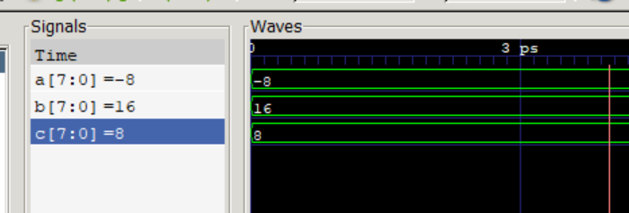
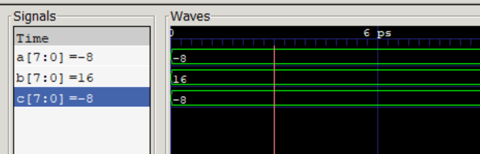

# div 测试
计算机中没有明确的正数和负数的划分

相反负数是以补码的形式保存在计算机中

在此简单的运用verilog的系统函数来验证rem、remw、以及remuw等指令的实现

```
// 数据位为8位
a -> 被除数
b -> 除数
c -> 余数

a 取 -8   ...... 1000_1000 -> 1111_1000 
b 取 16   ...... 0001_0000
则 c 为 -8 ..... 1111_1000
用 c = a % b 去算
```

如图看结果却是8

 

现在用verilog的 $signed()来补充

c = $signed(a) % $signed(b)

结果如图符合正确
 

 


