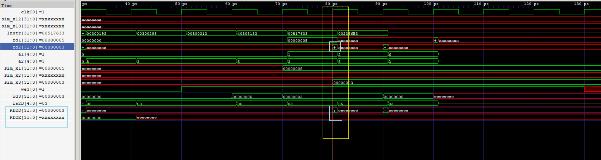
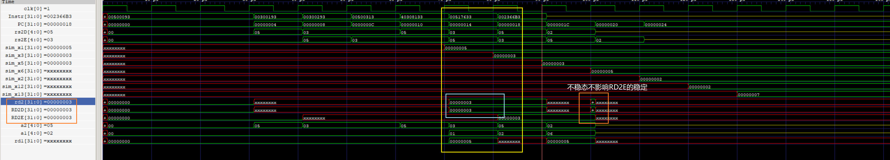

## 文件说明
```
├─prj
│  └─pipline
│-riscvpipeline.sv
|
|-build.bat         
|
|-testbench.sv
|
|-top_hardware.sv
|
|-M
|     
└─README.assets
```
prj存放vivado工程文件 -v2021.2

开发板 Genesys2

仿真编译工具 iverilog


xdc文件见文件目录
```
riscvpipeline.sv --> 面向仿真测试

build.bat        --> win下iverilog编译仿真

testbench.sv     --> 仿真文件

top_hardware.sv  --> 上板sv
```

M文件夹存放对RV32M指令集支持的五级流水CPU，并对MUL和DIV指令进一步的测试

## 信号说明
PCSrcE --> pc跳转选择信号 --> +4 or jump


## 测试方案：
（参考）

1.俩类数据冒险：

sub x2, x1, x3

and x12, x2, x5

or  x13, x6, x2

-> sub & and == 1a

-> sub & or  == 2b 

### 机器码
`sub x2,x1,x3` 机器码：

0100000_00011_00001_000_00010_0110011

`and x12, x2, x5` 机器码：

0000000_00101_00010_111_01100_0110011

`or x13, x6, x2`

0000000_00010_00110_110_01101_0110011


### 首先赋初值
`addi x1, x0, 5`

`addi x3, x0, 3`

`addi x5, x0, 3`

`addi x6, x0, 5`

0000_0000_0101_00000_000_00001_0010011

0000_0000_0011_00000_000_00011_0010011

0000_0000_0011_00000_000_00101_0010011

0000_0000_0101_00000_000_00110_0010011

x2 = 2 -> 0010
x6 = 5 -> 0101

           0010	             0010
	&   0011         |   0101
	-----------      ----------
	    0010            0111


**验证检查：**

x12 = 2

x13 = 7

00000000010100000000000010010011 ->00500093

00000000001100000000000110010011 ->00300193

00000000001100000000001010010011 ->00300293

00000000010100000000001100010011 ->00500313

01000000001100001000000100110011 ->40308133

00000000010100010111011000110011 ->00517633

00000000001000110110011010110011 ->002366B3


整体汇编如下：

	addi x1, x0, 5
	addi x3, x0, 3
	addi x5, x0, 3
	addi x6, x0, 5
	sub x2, x1, x3
	and x12, x2, x5
	or  x13, x6, x2  


测试： PASS 

2.基于此解决流水线过程中，regfile上升沿写的冒险

上述汇编 `addi x3,x0,3` 和 `sub x2,x1,x3` 在同一时钟周期对x3读和写

 


可以看到RD2E并没有将数据传递下去。目前思路是直接将写回值传给读出值。但一定要注意逻辑的先后顺序

测试： PASS

**结构冒险解决图**

 

### lw测试
```
addi x3, x

lw   x2, 96(x0)

add  x9, x2, x5
```

## 流水灯测试
	  #           RISC-V Assembly         Description                     Address     Machine Code
	  init:       addi t5, x0, 2047       # count_max, t5 = 2047          0           0x7FF00F13  # 0111_1111_1111_00000_000_11110_0010011
	              add  t5, t5, t5         # count_max, t5 = 2047*2        4           0x01EF0F33  # 0000_000_11110_11110_000_11110_0110011
	              add  t5, t5, t5         # count_max, t5 = 2047*4        8           0x01EF0F33  # 0000_000_11110_11110_000_11110_0110011
	              add  t5, t5, t5         # count_max, t5 = 2047*8        12          0x01EF0F33  # 0000_000_11110_11110_000_11110_0110011
	              add  t5, t5, t5         # count_max, t5 = 2047*16       16          0x01EF0F33  # 0000_000_11110_11110_000_11110_0110011
	              add  t5, t5, t5         # count_max, t5 = 2047*32       20          0x01EF0F33  # 0000_000_11110_11110_000_11110_0110011
	              add  t5, t5, t5         # count_max, t5 = 2047*64       24          0x01EF0F33  # 0000_000_11110_11110_000_11110_0110011
	              add  t5, t5, t5         # count_max, t5 = 2047*128      28          0x01EF0F33  # 0000_000_11110_11110_000_11110_0110011
	              add  t5, t5, t5         # count_max, t5 = 2047*256      32          0x01EF0F33  # 0000_000_11110_11110_000_11110_0110011
	              add  t5, t5, t5         # count_max, t5 = 2047*512      36          0x01EF0F33  # 0000_000_11110_11110_000_11110_0110011
	              add  t5, t5, t5         # count_max, t5 = 2047*1024     40          0x01EF0F33  # 0000_000_11110_11110_000_11110_0110011
	              add  t5, t5, t5         # count_max, t5 = 2047*2048     44          0x01EF0F33  # 0000_000_11110_11110_000_11110_0110011
	              add  t5, t5, t5         # count_max, t5 = 2047*4096     48          0x01EF0F33  # 0000_000_11110_11110_000_11110_0110011
	              add  t5, t5, t5         # count_max, t5 = 2047*8192     52          0x01EF0F33  # 0000_000_11110_11110_000_11110_0110011
	/for sim      addi t5, x0, 4                                          56          0x00200F13  # 0000_0000_0010_00000_000_11110_0010011
	              addi x2, x0, 1                                          60          0x00100113  # 0000_0000_0001_00000_000_00010_0010011
	              addi t6, x0, 256        # led_max, t6 = 256             64          0x20000f93  # 0001_0000_0000_00000_000_11111_0010011
	  clean_led:  addi t4, x0, 1          # init led value, t4 = 1        68          0x00100e93  # 0000_0000_0001_00000_000_11101_0010011
	  clean_cnt:  addi t3, x0, 0          # clear count(t3).              72          0x00000e13  # 0000_0000_0000_00000_000_11100_0010011
	  count:      addi t3, t3, 1          # count++                       76          0x001E0E13  # 0000_0000_0001_11100_000_11100_0010011
	              beq  t3, t5, mov_led              pc +8                 80          0x01EE0463  # 0000_000_11110_11100_000_01000_1100011
	              jal  count                        pc -8                 84          0xFF9FF06F  # 1_1111111100_1_11111111_00000_1101111
	  mov_led     add  t4, t4, t4                                         88          0x01DE8EB3  # 0000_000_11101_11101_000_11101_0110011
	              beq  t4, t6, right                pc +8                 92          0x01FE8463  # 0000_000_11111_11101_000_01000_1100011
	              jal  clean_cnt                    pc-24                 96          0xFE9FF06F  # 1_1111110100_1_11111111_00000_1101111
	  right       srl  t4, t4, x2                                         100         0x002EDEB3  # 0000000_00010_11101_101_11101_0110011
	              beq  t4, x2, clean_led            pc- 4*9               104         0xFC2E8EE3  # 1111_110_00010_11101_000_11101_1100011
	  clean_cnt2: addi t3, x0, 0                                          108         0x00000e13  # 0000_0000_0000_00000_000_11100_0010011           
	  count2:     addi t3, t3, 1                                          112         0x001E0E13  # 0000_0000_0001_11100_000_11100_0010011             
	              beq  t3, t5, right                pc- 4*4               116         0xFFEE08E3  # 1111_111_11110_11100_000_10001_1100011
	              jal  count2                       pc-8                  120         0xFF9FF06F  # 1_1111111100_1_11111111_00000_1101111

Note:可以上板验证，为了简化仿真，添加仿真指令`addi t5, x0, 4`,防止仿真时间过长。

实际上板就去掉 **for sim** 汇编

**ToDo**
- [ ] 完善对M文件夹的排版和注释